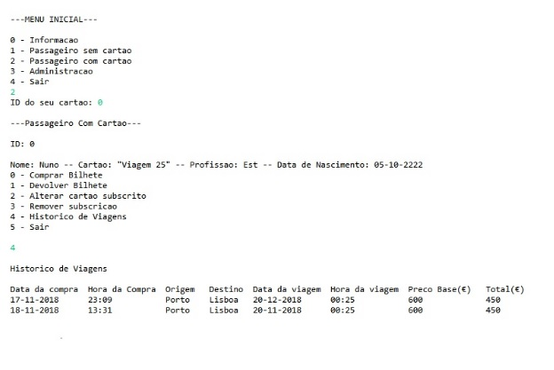

# Viage e Poupe

Group Project for Data Structures and Algorithms class at Faculty of Engineering of the University of Porto on a train management program in C++.

## Members:
* Nuno Miguel Fernandes Marques
* Maria Helena Viegas Oliveira Ferreira
* João Filipe Carvalho de Araújo

## Doxygen Documentation:

[Classes Documentation](https://nunomiguel22.github.io/AEDA-viage_poupe/index.html "Doxygen documentation")

## Screenshot:

